# Credit Risk Analysis

## Overview
The purpose of the analysis is to train and test the credit card credit dataset through various evaluation models to determine which model should be used to predict credit risk.

## Results
* Random Oversampling 
    - Balanced Accuracy Report 
    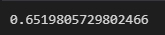  
    - Precision & Recall Report  
    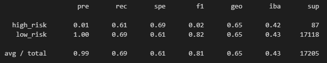  
* SMOTE 
    - Balanced Accuracy Report 
    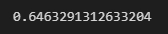 
    - Precision & Recall Report  
    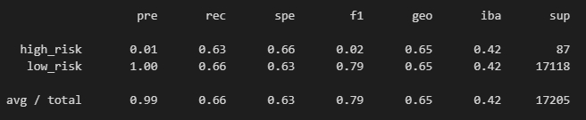  
* Cluster Centroids 
    - Balanced Accuray Report 
    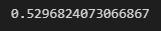 
    - Precision & Recall Report  
    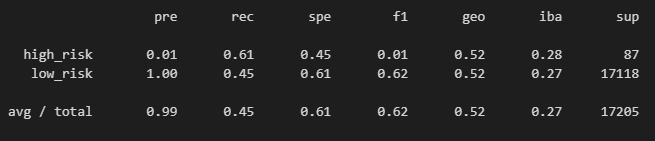  
* SMOTEENN 
    - Balanced Accuray Report 
    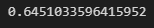 
    - Precision & Recall Report  
    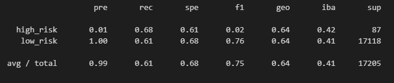  
* Random Forest 
    - Balanced Accuray Report 
    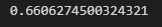 
    - Precision & Recall Report - highest precision & recall rate 
    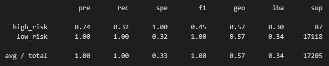  
* Easy Ensemble 
    - Balanced Accuray Report - highest accuracy rate 
    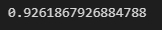 
    - Precision & Recall Report  
    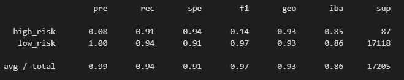 

## Summary

Throughout different testing models, "Easy Ensemble" had the highest balanced accuracy (0.926) while "Random Forest" showed the highest precicion & recall rates (see below image).  
      

Credit reporting requires high rates all categories of accuracym, precision, and recall. However, none of the models have resulted with high rates in all 3 categories. Although random forest model showed highest precision & recall rates amongst all the models, the recall rate for high risk is only at 0.32, meaning only 32% of the high risk credit will be diagnosed as high risk. In easy ensemble model, the recall rates on both the high risk and low risk were over 90%; however, precision rate on high risk was only at 8%, which means there could be a lot of false-reportings for high risk credit reports. Therefore, none of the models will fit to analyze the credit card credit data.